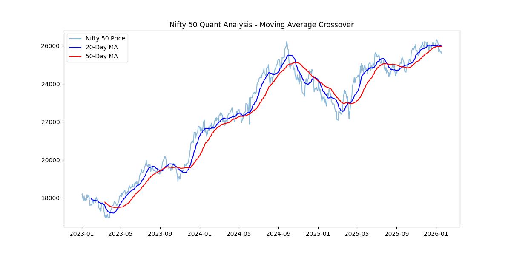
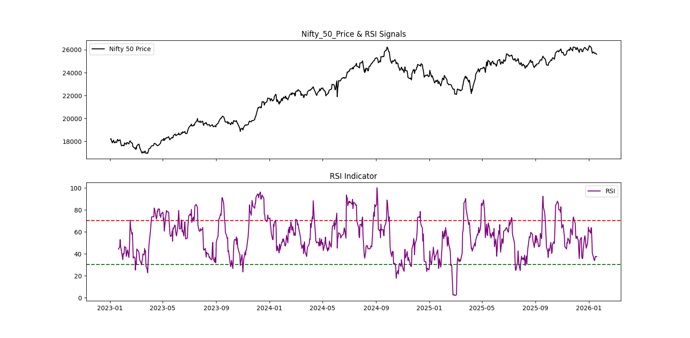
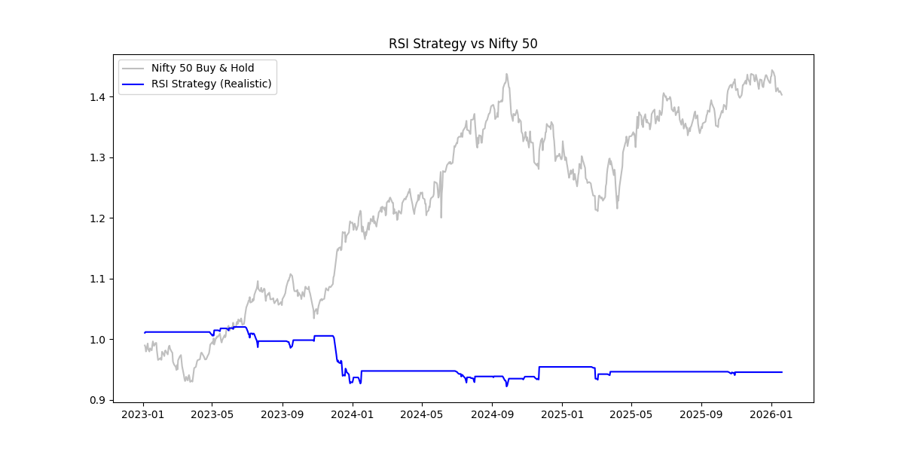

# Quantitative Finance Projects 📈
### Systematic Trading Research on Indian Markets


> A research-driven repository documenting the development of systematic trading strategies on Indian equity indices. Each project builds on the findings of the previous — moving from simple signal testing toward multi-factor, ML-enhanced models.

---

## 🗺️ Research Roadmap

| Project | Strategy | Status | Key Finding |
|--------|----------|--------|-------------|
| 01 | Nifty 50 Moving Average Crossover | ✅ Complete | Trend signals identified, used as baseline |
| 02 | RSI Mean Reversion (Reality-Adjusted) | ✅ Complete | Standalone RSI fails after Indian market friction |
| 03 | ML-Enhanced Multi-Factor Model | 🔄 In Progress | Combining MA + RSI + ML filter |
| 04 | Mine-M: Autonomous Alpha Engine | 📋 Planned | Full agentic trading intelligence system |

---

## 📊 Project 01: Nifty 50 Trend Follower

**Strategy:** Moving Average Crossover (20-day vs 50-day)

**Objective:** Establish a momentum baseline on India's benchmark index using the most fundamental trend-following signal.

**Methodology:**
- Data sourced via `yfinance` for Nifty 50 (`^NSEI`) from 2023–2026
- Buy signal generated when 20-day MA crosses above 50-day MA
- Sell signal when 20-day MA crosses below 50-day MA

**Visualisation:**



**Key Learnings:**
- MA crossover correctly identified the major bull run from mid-2023 to mid-2024
- Strategy struggled during sideways/choppy markets — too many false crossovers
- Established as the **baseline momentum signal** for Project 03's multi-factor model

---

## 📊 Project 02: RSI Mean Reversion (Reality-Adjusted)

**Strategy:** RSI Oversold/Overbought with Indian Market Friction

**Objective:** Test whether a classic RSI mean-reversion signal survives real-world Indian market conditions — not just theoretical backtests.

**Methodology:**
- RSI(14) calculated on daily Nifty 50 close prices
- Buy when RSI < 30 (oversold), Sell when RSI > 70 (overbought)
- **Realistic friction applied:**
  - Execution lag: 1-day shift (signal at close, trade at next open)
  - Transaction costs: 0.15% per trade (Indian STT + exchange charges)

**Visualisations:**


*RSI oscillating between oversold (30) and overbought (70) zones on Nifty 50*


*RSI Strategy (blue) vs Nifty 50 Buy & Hold (grey) — 2023 to 2026*

**Results:**

| Metric | Value |
|--------|-------|
| Final Return (post-cost) | -5.46% |
| Nifty 50 Buy & Hold Return | +41.2% |
| Max Drawdown | -9.63% |
| Transaction Cost Impact | Significant |

**Conclusion:**

> Standalone RSI signals on Nifty 50 are insufficient to overcome Indian market friction. The strategy suffers from signal frequency — each transaction incurs costs that compound negatively over time. **This finding directly motivates Project 03:** combining RSI with MA momentum and an ML filter to reduce false signals and improve signal quality.

**This is the correct research methodology** — a negative result that leads to a better hypothesis is more valuable than a fabricated positive backtest.

---

## 🔄 Project 03: ML-Enhanced Multi-Factor Model *(In Progress)*

**Hypothesis:** Combining MA trend signals + RSI mean-reversion + a Random Forest classifier to filter low-quality signals will produce a strategy that survives transaction costs.

**Planned Features:**
- Feature engineering: MA slope, RSI value, volume ratio, volatility regime
- Random Forest classifier to predict signal quality (trade vs no-trade)
- Walk-forward validation to prevent data leakage
- Same realistic friction model as Project 02

**Status:** Building feature matrix — updates pushed regularly.

---

## 📋 Project 04: Mine-M — Autonomous Alpha Engine *(Planned)*

**Vision:** A fully autonomous trading intelligence system that:
- Ingests real-time NSE data across Nifty 50, Bank Nifty, Midcap Nifty
- Performs NLP sentiment analysis on financial news and global events
- Combines quantitative signals with sentiment scores
- Generates ranked trade opportunities with confidence scores
- Flags setups for human review before execution

**Tech Stack Planned:** Python, FastAPI, Docker, PostgreSQL, Hugging Face Transformers, Plotly Dash

---

## 🛠️ Tech Stack

```
Data Collection   : yfinance, NSE Python
Data Processing   : pandas, numpy
Technical Analysis: pandas_ta
Visualisation     : matplotlib, plotly
Machine Learning  : scikit-learn (Project 03)
Deep Learning     : PyTorch (Project 04)
Deployment        : FastAPI, Docker (Project 04)
```

---

## 🚀 Getting Started

```bash
# Clone the repository
git clone https://github.com/PawanParackal/Quantitative-Finance-Projects.git
cd Quantitative-Finance-Projects

# Install dependencies
pip install yfinance pandas numpy matplotlib pandas_ta

# Run Moving Average strategy
python nifty_analysis.py

# Run RSI backtest
python rsi_strategy.py
```

---

## 📌 Key Research Principles

1. **Realistic over optimistic** — All backtests include transaction costs and execution lag
2. **Honest reporting** — Negative results documented and used to improve hypothesis
3. **India-specific** — All strategies account for NSE market structure, STT, and liquidity
4. **Progressive complexity** — Each project directly builds on findings of the previous

---

## 👤 Author

**Pawan Suresh Parackal**
Graduate Certificate in Data Science — University of Queensland
[LinkedIn](https://www.linkedin.com/in/pawan-parackal-a50b891aa/) | [GitHub](https://github.com/PawanParackal)

*Open to Data Science, ML Engineering, and Quantitative Finance roles — India and abroad*
